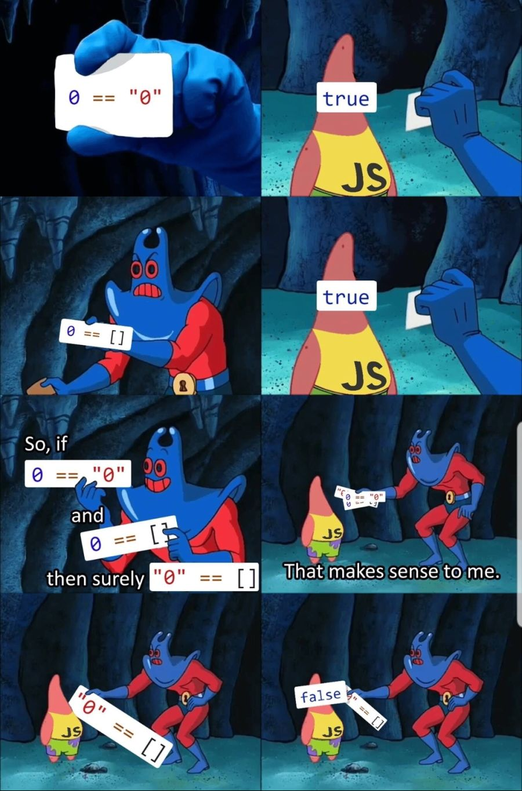

# J❤5(JS25)🛸 Javascript Study
## 참여자 👓
- <a href="https://github.com/hyunbingil">길 현 빈</a>
- <a href="https://github.com/nsbg">김 보 금</a>
- <a href="https://github.com/tbnsok40">임 성 후</a>
- <a href="https://github.com/dongyeopca">차 동 엽</a>
## 개요 🛬
- 자바스크립트를 익혀 좀 더 동적인 웹개발을 하기 위한 스터디입니다.
- 코딩 테스트를 자바스크립트로 칠 수 있을 만큼 단련합니다.
- 더 나아가서 라이브러리인 React나 프레임워크인 React Native를 공부하기 위한 기초 밑거름을 다집니다.
## 일정 📆
- 두 달(총 8주) 동안 진행합니다.
- 일주일에 1번 오프라인 모임을 가집니다.

## 주차별 주제 🎢
### 7月
### WEEK1 📁
- velopert Javascript로 이론 다지기(1,2장)
- 배열 관련 문제 풀이(1.8)
#### HOMEWORK 📃
- 이론 다지기 문제 2문제(1.9, 2.7)
- 동기, 비동기 이론 공부해오기
- 배운 내용 복습하기

### WEEK2 📁
- velopert Javascript로 이론 다지기(3,4장)
- JS 문제 풀이(14, 15, 17)
- counter과 modal 만들어보기
#### HOMEWORK 📃
- 이론 다지기 문제 2문제
- 배운 내용 복습하기

### WEEK3 📁
- 숙제 코드 리뷰
- JS 문제 풀기
- 시계(clock)와 인사말(greeting) 만들어보기
#### HOMEWORK(택1) 📃
- JS 문제 못 푼 문제 풀기
- 노마드 코더 강의 3-1 ~ 3-4 들으면서 복습

### 8月
### WEEK4 📁
- todolist 마무리하기
- 본격적으로 만들어 볼 프로젝트 아이디어 구상하기
#### HOMEWORK 📃
- 오늘 만들어본 todolist 확장시켜보기\
ex) 배경 몇 초마다 바뀌게하기, css로 예쁘게 꾸며보기, 배경 이름 숫자말고 다른 것으로 받아와보기 등
- 이론 다지기 문제 2문제

### WEEK5 📁
- 프로젝트 아이디어 구상하기
- 인스타그램 클론 코딩 뼈대 만들기 및 역할 분담
- 이론 다지기 문제 2문제 풀이 (다음주 진행ㅠ)

#### HOMEWORK 📃
- 각자 맡은 부분 백엔드 모델 만들기 및 간단한 기능 구현
- 프론트엔드는 기능 테스트 할 수 있을 정도로 만들어 오기
- (선택) 자바스크립트 문제 풀어오기

## 스터디 방식 👩‍💻
: 초반에는 이론을 주로 다지고, 그 후에는 문제 풀이와 미니프로젝트 진행을 병행한다.\
: 주 마다 돌아가면서 스터디를 진행한다.
### WEEK1 (2020.07.15) 💌
```길현빈``` : 자바스크립트 기초, 유용한 함수들

### WEEK2 (2020.07.22) 💌
```임성후``` : 동기/비동기(callback, promise, async, await), 간단한 실습

### WEEK3 (2020.07.29) 💌
```길현빈``` : 자바스크립트 문제 풀이(심화), todolist 만들기(초반)
> 텍스트 에디터를 만들려고 했지만, 너무 복잡해서 todolist 먼저 실습

### WEEK4 (2020.08.05) 💌
```차동엽``` : todolist 만들기(마무리), 프로젝트 구상

### WEEK5 (2020.08.12) 💌
: 프로젝트 구상, 인스타그램 클론 코딩 관련 회의

