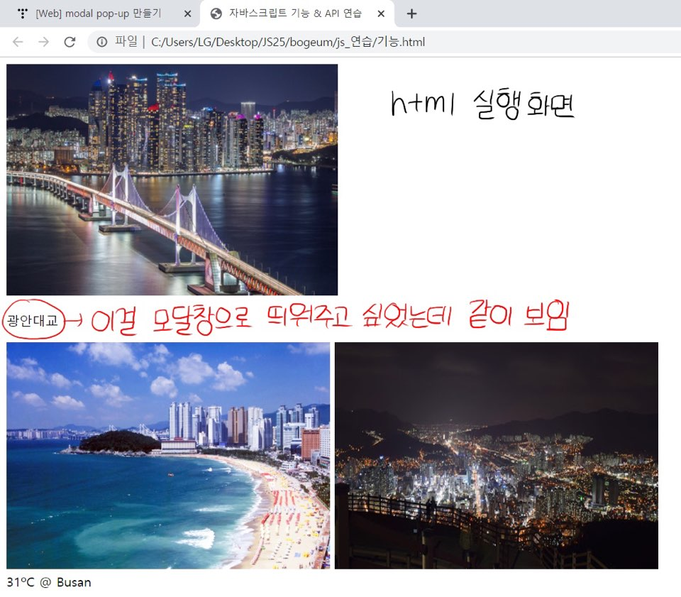
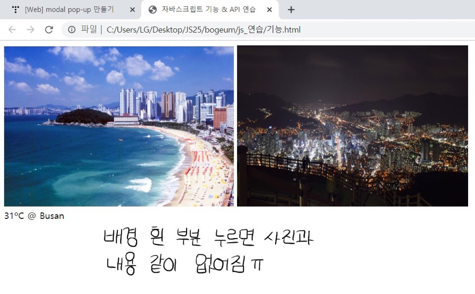

### JS 기능 & API 써보기   
     
⭕ **넣은 기능**    
   
각 사진에 마우스를 올리면 이미지가 커지면서 옆의 이미지를 미는 듯한 효과   
(onmouseenter="zoomIn(event)")    
   
마우스를 떼면 이미지가 원래 사이즈로 돌아옴   
(onmouseenter="zoomOut(event)")    
   
모달창    
(첫번째 이미지만 클릭하면 '광안대교' 가 적힌 모달창 띄워줌)    
        
API      
(가장 무난한 날씨 API / 부산 기온 보여줌)     
   
   
❓ **2% 부족한 부분**   
   
광안대교 이미지를 클릭하면 이미지는 그대로 두고 모달창만 띄웠다가 끄는 걸 구현하고 싶었는데 이미지에 모달용 id를 같이 넣었더니 이미지가 보이는 것 자체가 모달창이 떠있는 걸로 처리돼서 배경 아무데나 누르면 사진이 같이 없어짐 ,,   
    
   
   

​